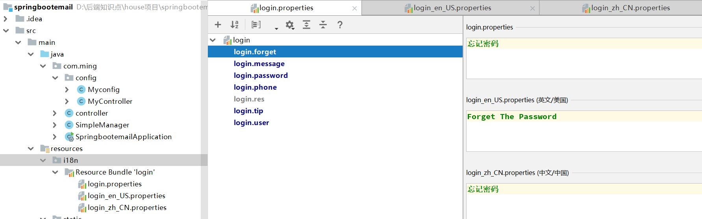

### 国际化

1. **先看看源码**

   >
   >
   >```java
   >WebMvcAutoConfiguration 类下面的源码
   >```
   >
   >
   >
   >```java
   >@Override
   >@Bean
   >@ConditionalOnMissingBean(name = DispatcherServlet.LOCALE_RESOLVER_BEAN_NAME)
   >@SuppressWarnings("deprecation")
   >public LocaleResolver localeResolver() {
   >   if (this.webProperties.getLocaleResolver() == WebProperties.LocaleResolver.FIXED) {
   >      return new FixedLocaleResolver(this.webProperties.getLocale());
   >   }
   >   if (this.mvcProperties.getLocaleResolver() == WebMvcProperties.LocaleResolver.FIXED) {
   >      return new FixedLocaleResolver(this.mvcProperties.getLocale());
   >   }
   >   AcceptHeaderLocaleResolver localeResolver = new AcceptHeaderLocaleResolver();
   >   Locale locale = (this.webProperties.getLocale() != null) ? this.webProperties.getLocale()
   >         : this.mvcProperties.getLocale();
   >   localeResolver.setDefaultLocale(locale);
   >   return localeResolver;
   >}
   >```


### 自定义一个地区解析器

1. 后端

   >```java
   >public class MyController implements LocaleResolver {
   >    @Override
   >    public Locale resolveLocale(HttpServletRequest request) {
   >
   >        String language = request.getParameter("l");
   >        Locale locale = Locale.getDefault();
   >        if (!StringUtils.isEmpty(language)){
   >
   >            String[] split = language.split("_");
   >             locale = new Locale(split[0], split[1]);
   >        }
   >
   >        return locale;
   >    }
   >
   >    @Override
   >    public void setLocale(HttpServletRequest request, HttpServletResponse response, Locale locale) {
   >
   >    }
   >```

   >```java
   >	//最后把自定义地区解析器交给spring容器
   >    @Bean
   >    public LocaleResolver localeResolver(){
   >        return  new MyController();
   >
   >    }
   >```


2、前端	

```html
 <div class="submit-layer" style="margin-top:32px">
                        <input class="hide-submit" type="submit" />
                        <a class="free-use-btn btn-blue btn-submit"><span th:text="#{login.tip}">登录</span></a>
                        <div class="display-inline-block ml4" style="font-size:12px;">
                            <span class="hide-mobile" th:text="#{login.user}">还没有账号?</span>
                            <a class="hide-mobile" href="https://me.bdp.cn/register.html">[[#{login.res}]]</a>
                            <a th:href="@{/login.html(l='zh_CN')}">中文</a>
                            <a th:href="@{/login.html(l='en_US')}">English</a>
                        </div>
                    </div>
```

### 配置properties

>

>
>
>application.properties
>
>```properties
>#配置文件的真实位置
>spring.messages.basename=i18n.login
>```
>
>